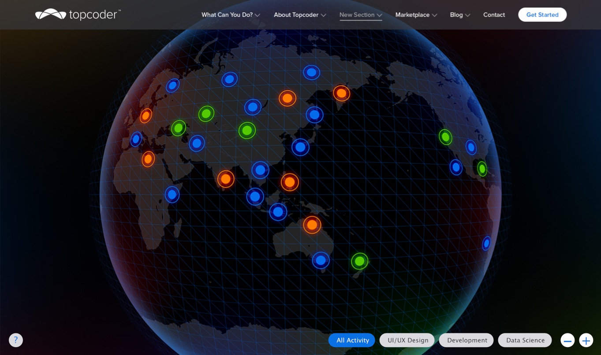

* [Design Challenge](https://www.topcoder.com/challenge-details/30055851/?type=design&noncache=true)

* [Code Challenge 1: VISUAL REPRESENTATION OF TOPCODER ACTIVITY ](https://www.topcoder.com/challenge-details/30057746/)

## Code Challenge 2: VISUAL REPRESENTATION OF TOPCODER ACTIVITY Part 2

For this challenge you combine the two solutions from a previous challenge that visually represents Topcoder member activity.

### Code Challenge 1: VISUAL REPRESENTATION OF TOPCODER ACTIVITY Results
This challenge resulted in 4 visually appealing solutions.  The winning solution by choke68 was the only one that used the real data stream.  The live app can be seen [here](https://coronav2-choke68.herokuapp.com/). As you can see from the image below this solution is a rotating global that monetarily highlights activity by 3 concentric yellow rings that fade in and fade out in about a second as the globe turns.  It is interesting but does not show all the activity at a single view.  It is based on [Planetary.js](http://planetaryjs.com/) and pulls from the [quake example](http://planetaryjs.com/examples/quake.html).   Since this is based on earthquakes and the time they are running it has some concepts we are looking for but it is not quite right.   The more important thing is that is uses the streaming data feed.    It requires the animation and to watch over a period of time to get a sense of the activity.  By looking at the source of this submission you can see that choke68 took a static list of 15000 cites that are already geocoded so they could be mapped by the streaming data that contained the city names.  The local pseudo geocoding service will allow for great performance when there are a large number of data points.

Another submission by daft300punk has really nice visuals but does not use the real data stream, However daft300punk did a great job representing what we wanted with the filtering.  See the screenshot below.

Also you can see the live demo of this submission [here:](https://corona2-daft300punk.herokuapp.com/)

For this challenge we want to take the design from daft300punks solution and use the local geolocation service of chok68.

### Data endpoints

 * [343 was used in the above challenge but it does not include all types of data](https://api.topcoder.com/v4/looks/343/run/json/)
 * [349 should be used instead and it has all the challenge types](https://api.topcoder.com/v4/looks/339/run/json/)
