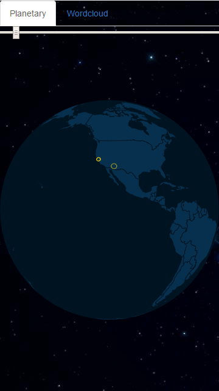
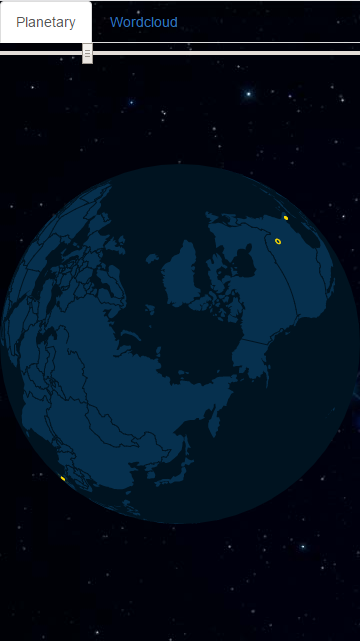

# topcoder-activity-visualizer
> Deployment Guide

## Online demo

- Heroku

[https://fast-plains-60337.herokuapp.com](https://fast-plains-60337.herokuapp.com)

## Heroku deployment

- You will need to install [Heroku Toolbelt](https://toolbelt.heroku.com/) for this step if you don't already have it installed.

- In the main project folder, run the following commands:

<pre>
heroku login
git init
heroku create -b https://github.com/mars/create-react-app-buildpack.git
git add .
git commit -m "react-create-app on Heroku"
git push heroku master
heroku open
</pre>

## Local deployment

- In the main project folder, run the following commands:

<pre>
npm install
npm run start
</pre>

## App walkthrough

- Splash screen when the apps is launched.

- Planetary activity is shown. Earth globe rotates automatically and activity will be shown in a "loop" play (auto-repeat once finished).

- User can use mouse (or finger if on his/her cellphone) dragging to rotate view. 

- Clicking / Tapping in Wordcloud will make words with high frequency in challenge text to appear bigger than others with less frequency.  

## Tests

- Run this command to run unit tests.

<pre>
npm test
</pre>
